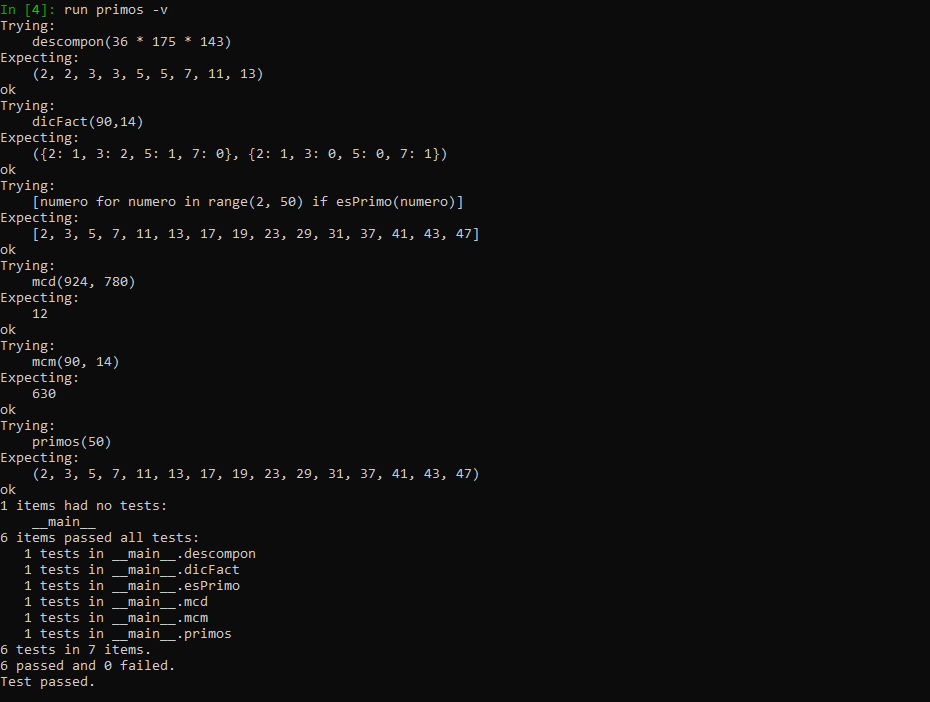
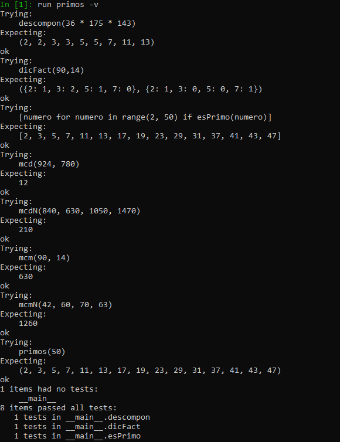
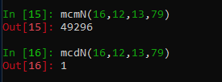

# Segunda tarea de APA 2023: Manejo de números primos

## Nom i cognoms
### Rafael E. Moncayo Palate

## Fichero `primos.py`

- El alumno debe escribir el fichero `primos.py` que incorporará distintas funciones relacionadas con el manejo
  de los números primos.

- El fichero debe incluir una cadena de documentación que incluirá el nombre del alumno y los tests unitarios
  de las funciones incluidas.

- Cada función deberá incluir su propia cadena de documentación que indicará el cometido de la función, los
  argumentos de la misma y la salida proporcionada.

- Se valorará lo pythónico de la solución; en concreto, su claridad y sencillez, y el uso de los estándares marcados
  por PEP-8. También se valorará su eficiencia computacional.

### Determinación de la *primalidad* y descomposición de un número en factores primos

Incluya en el fichero `primos.py` las tres funciones siguientes:

- `esPrimo(numero)`   Devuelve `True` si su argumento es primo, y `False` si no lo es.
- `primos(numero)`    Devuelve una **tupla** con todos los números primos menores que su argumento.
- `descompon(numero)` Devuelve una **tupla** con la descomposición en factores primos de su argumento.

### Obtención del mínimo común múltiplo y el máximo común divisor

Usando las tres funciones del apartado anterior (y cualquier otra que considere conveniente añadir), escriba otras
dos que calculen el máximo común divisor y el mínimo común múltiplo de sus argumentos:

- `mcm(numero1, numero2)`:  Devuelve el mínimo común múltiplo de sus argumentos.
- `mcd(numero1, numero2)`:  Devuelve el máximo común divisor de sus argumentos.

Estas dos funciones deben cumplir las condiciones siguientes:

- Aunque se trate de una solución sub-óptima, en ambos casos deberá partirse de la descomposición en factores
  primos de los argumentos usando las funciones del apartado anterior.

- Aunque también sea sub-óptimo desde el punto de vista de la programación, ninguna de las dos funciones puede
  depender de la otra; cada una debe programarse por separado.

### Obtención del mínimo común múltiplo y el máximo común divisor para un número arbitrario de argumentos

Escriba las funciones `mcmN()` y `mcdN()`, que calculan el mínimo común múltiplo y el máximo común divisor para un
número arbitrario de argumentos:

- `mcmN(*numeros)`:  Devuelve el mínimo común múltiplo de sus argumentos.
- `mcdN(*numeros)`:  Devuelve el máximo común divisor de sus argumentos.

### Tests unitarios

La cadena de documentación del fichero debe incluir los tests unitarios de las cinco funciones. En concreto, deberán
comprobarse las siguientes condiciones:

- `esPrimo(numero)`:  Al ejecutar `[ numero for numero in range(2, 50) if esPrimo(numero) ]`, la salida debe ser
                      `[2, 3, 5, 7, 11, 13, 17, 19, 23, 29, 31, 37, 41, 43, 47]`.
- `primos(numeor)`: Al ejecutar `primos(50)`, la salida debe ser `(2, 3, 5, 7, 11, 13, 17, 19, 23, 29, 31, 37, 41, 43, 47)`.
- `descompon(numero)`: Al ejecutar `descompon(36 * 175 * 143)`, la salida debe ser `(2, 2, 3, 3, 5, 5, 7, 11, 13)`.
- `mcm(num1, num2)`: Al ejecutar `mcm(90, 14)`, la salida debe ser `630`.
- `mcd(num1, num2)`: Al ejecutar `mcd(924, 780)`, la salida debe ser `12`.
- `mcmN(numeros)`: Al ejecutar `mcm(42, 60, 70, 63)`, la salida debe ser `1260`.
- `mcdN(numeros)`: Al ejecutar `mcd(840, 630, 1050, 1470)`, la salida debe ser `210`.

### Entrega

_Funciones hechas en clase:_ \n
**esPrimo**
``` python
def esPrimo(numero):
    """
    Devuelve `True` si su argumento es primo, y `False` si no lo es

    >>> [numero for numero in range(2, 50) if esPrimo(numero)]
    [2, 3, 5, 7, 11, 13, 17, 19, 23, 29, 31, 37, 41, 43, 47]
    """
    for prueba in range(2,int(numero**0.5)+1):        
        if numero % prueba == 0: return False
    return True
```
**prrimos**
``` python
def primos(numero):
    """
    Devuelve una **tupla** con todos los números primos menores que su argumento.

    >>> primos(50)
    (2, 3, 5, 7, 11, 13, 17, 19, 23, 29, 31, 37, 41, 43, 47)
    """
    return tuple([prueba for prueba in range(2, numero) if esPrimo(prueba)])

```
**Descompon**
``` python
def descompon(numero):

    '''
    Devuelve una **tupla** con la descomposición en factores primos de su argumento.
    >>> descompon(36 * 175 * 143)
    (2, 2, 3, 3, 5, 5, 7, 11, 13)
    '''
    factores=[]
    for factor in primos(numero):
        while numero%factor == 0:
            factores.append(factor) #append: añadir a una lista
            numero//= factor
    return tuple(factores)
```
**mcm**
``` python
def dicFact(numero1,numero2):
    """
    Devuelve el factor primo de un número con su correspondiente exponente. 
    La función tiene como argumento dos números.
    >>> dicFact(90,14)
    ({2: 1, 3: 2, 5: 1, 7: 0}, {2: 1, 3: 0, 5: 0, 7: 1})
    """
    #se busca que las potencias (factores) se sumen pero en un conjunto porque el conjunto no tiene repeticiones
    factores1 = descompon(numero1)
    factores2 = descompon(numero2)
    factores = set(factores1 + factores2)
    dicfact1 ={factor : 0 for factor in factores } 
    dicfact2 ={factor : 0 for factor in factores} 
    for factor in factores1 : dicfact1[factor] += 1
    for factor in factores2 : dicfact2[factor] += 1
    return dicfact1,dicfact2

def mcm(numero1,numero2):

    '''
    Devuelve el mínimo común múltiplo de sus argumentos.
    >>> mcm(36,30)
    180
    '''
    mcm = 1
    dicFact1, dicFact2 = dicFact(numero1, numero2)
    for factor in dicFact1 | dicFact2:
        mcm *= factor ** max(dicFact1[factor],dicFact2[factor])
    return mcm
```
**mcd**
``` python
def mcd(numero1,numero2):

    '''
    Devuelve el máximo común divisor de sus argumentos.
    >>> mcd(924, 780)
    12
    '''
    mcd = 1
    dicFact1, dicFact2 = dicFact(numero1, numero2)
    for factor in dicFact1 | dicFact2:
        mcd *= factor ** min(dicFact1[factor],dicFact2[factor])
    return mcd
```
**run primos -v**


**run mcmN**
```python
def mcmN(*numeros):

    '''
    Devuelve el máximo común divisor de sus argumentos.
    >>> mcmN(42, 60, 70, 63)
    1260
    '''
    mcm = 1
    for posicion in range(1,len(numeros)):
        
        if posicion== 1:
            dicFact1, dicFact2 = dicFact(numeros[posicion], numeros[posicion-1])
            for factor in dicFact1 | dicFact2:
                mcm *= factor ** max(dicFact1[factor],dicFact2[factor])
            
        else:
            mcmaux= 1
            dicFact1, dicFact2 = dicFact(mcm,numeros[posicion])
            for factor in dicFact1 | dicFact2:
                mcmaux *= factor ** max(dicFact1[factor],dicFact2[factor])

            mcm= mcmaux
    return mcm
``` 
**run McdN**
```python
def mcdN(*numeros):

    '''
    Devuelve el mínimo común múltiplo de sus argumentos.
    >>> mcdN(840, 630, 1050, 1470)
    210
    '''
    mcd = 1
    for posicion in range(1,len(numeros)):
        
        if posicion== 1:
            dicFact1, dicFact2 = dicFact(numeros[posicion], numeros[posicion-1])
            for factor in dicFact1 | dicFact2:
                mcd *= factor ** min(dicFact1[factor],dicFact2[factor])
            
        else:
            mcmaux= 1
            dicFact1, dicFact2 = dicFact(mcd,numeros[posicion])
            for factor in dicFact1 | dicFact2:
                mcmaux *= factor ** min(dicFact1[factor],dicFact2[factor])

            mcd= mcmaux
    return mcd

```


Hay que mencionar por encima que he trabajado sin las opciones de mcm ni Mcd, previamente trabajadas, ya que he entendido que estábamos diseñando una función que las sobrescribía.
También me gustaría comentar que estas funciones van bien hasta que se les mete por parámetros un número primo y esto es por como están diseñadas las funciones previas al mcmN y mcdN.
En el caso de que queramos corregir eso, solamente deberíamos tener en cuenta la función de **descompon(numero)** .\n
El cambio a realizar recae en el RETURN de esta función. Previamente, teníamos que la función nos devolvía una tupla vacía cuando se encontraba con cualquier valor primo. Si antes de retornarla vacía evaluamos el contenido de la tupla, si la tenemos vacía significa que el único múltiple de ese número es ese mismo número, así que es el valor que debe meterse en la tupla de factores y es el que se tiene que acabar retornando.

```python
def descompon(numero):

    '''
    Devuelve una **tupla** con la descomposición en factores primos de su argumento.
    >>> descompon(36 * 175 * 143)
    (2, 2, 3, 3, 5, 5, 7, 11, 13)
    '''
    factores=[]
    for factor in primos(numero):
        while numero%factor == 0:
            factores.append(factor) #append: añadir a una lista
            numero //= factor

    if factores==[]:
        factores.append(numero)
        return tuple(factores)
    return tuple(factores)

```



#### Ejecución de los tests unitarios

Inserte a continuación una captura de pantalla que muestre el resultado de ejecutar el fichero `primos.py` con la opción
*verbosa*, de manera que se muestre el resultado de la ejecución de los tests unitarios.

#### Código desarrollado

Inserte a continuación el contenido del fichero `primos.py` usando los comandos necesarios para que se realice el
realce sintáctico en Python del mismo.

#### Subida del resultado al repositorio GitHub ¿y *pull-request*?

El fichero `primos.py`, la imagen con la ejecución de los tests unitarios y este mismo fichero, `README.md`, deberán
subirse al repositorio GitHub mediante la orden `git push`. Si los profesores de la asignatura consiguen montar el
sistema a tiempo, la entrega se formalizará realizando un *pull-request* al propietario del repositorio original.

El fichero `README.md` deberá respetar las reglas de los ficheros Markdown y visualizarse correctamente en el repositorio,
incluyendo la imagen con la ejecución de los tests unitarios y el realce sintáctico del código fuente insertado.
